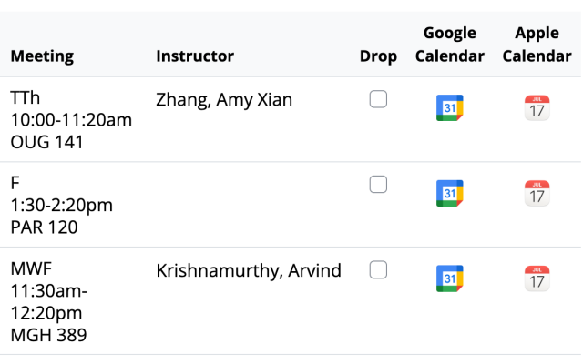
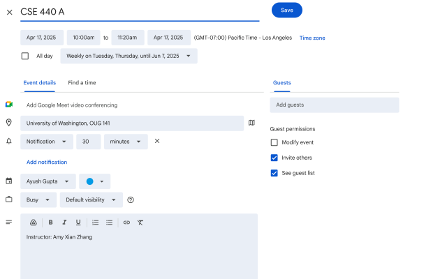

# UW Calendar Exporter




### Say Goodbye to Manual Calendar Entry! 📅

Tired of manually entering each class's details into your calendar every time you register? With **UW Calendar Exporter**, you can easily export each of your University of Washington courses from your registration page to Google or Apple Calendar. No more worrying about adding locations, days, times, or repeat schedules! Just click a button for each class, and let the extension handle the rest.

Instead of manually entering every class, this tool allows you to add only the courses you want to your calendar. Each button click generates a Google Calendar event or downloads an ICS file, which automatically fills in details like course name, professor, location, class times, and weekly recurrence until the end of the quarter.

### Features ✨

- **Dynamic Quarter Dates**: Automatically scrapes current quarter start/end dates from the official UW Academic Calendar
- **Per-Class Export**: Choose which classes to add to your calendar with an easy button for each one
- **Automatic Event Details**: The extension populates course name, professor, location, time, and recurrence until the end of the quarter
- **Google Calendar Integration**: Opens a Google Calendar event page with all details filled in, ready for you to save
- **Apple Calendar Compatibility**: Downloads an ICS file that you can open to add the event directly to Apple Calendar
- **User-Friendly**: Seamless interface accessible directly on the University of Washington's registration page
- **Tested & Reliable**: Comprehensive test suite ensures accurate date parsing and calendar generation

### Installation ⚙️

1. Download or clone this repository
2. Open Chrome and navigate to `chrome://extensions/`
3. Enable "Developer mode" in the top right
4. Click "Load unpacked" and select the extension folder
5. Navigate to your UW registration page and start exporting!

### Development & Testing 🧪

This extension includes a comprehensive test suite to ensure accuracy:

```bash
# Install dependencies
npm install

# Run unit tests with sample data
npm test

# Run live tests against UW website
npm run test:live

# View actual quarter dates for next 10 quarters
npm run view-dates
```

### How It Works 🔧

1. **Date Scraping**: The extension fetches quarter start/end dates from the official UW Academic Calendar
2. **Background Processing**: Uses a service worker to bypass CORS restrictions when fetching calendar data
3. **Smart Parsing**: Extracts course details from the registration page table
4. **Calendar Generation**: Creates properly formatted calendar events with recurrence rules

### File Structure 📁

- `content.js` - Main extension logic, DOM manipulation
- `background.js` - Service worker for fetching calendar data
- `calendar-parser.js` - Utility functions for parsing UW calendar HTML
- `manifest.json` - Extension configuration
- `test-*.js` - Test suites for validation
- `view-quarter-dates.js` - Tool to view actual quarter dates

### Privacy & Data Collection 🔐

The **UW Calendar Exporter** extension **does not collect or store any personal data**. It only processes the course information displayed on your University of Washington registration page to help create calendar events. Calendar data is fetched directly from public UW websites. No user data is transmitted to any external server.

### Contributions 🤝

We welcome contributions, bug reports, and feature requests! Check the [issues page](https://github.com/ayushgupta35/UW-Calendar-Exporter/issues) if you encounter any bugs or have suggestions.

1. Fork this repository 🍴
2. Create a branch: `git checkout -b feature/your-feature-name`
3. Make your changes and add tests if applicable
4. Run `npm test` to ensure all tests pass
5. Submit a pull request with your changes

### License

[MIT License](LICENSE)

---

This extension is **independently developed** and is **not affiliated with or endorsed by**:
- **University of Washington**
- **Google Calendar**
- **Apple Calendar**

It is a non-profit tool designed purely to help UW students streamline their scheduling process 📘.

# Privacy Policy 🛡️

### UW Calendar Exporter

The **UW Calendar Exporter** ("we", "our", or "the extension") does not collect, store, or share any personal data from users. The extension solely interacts with the information on the University of Washington registration page to help create events in Google or Apple Calendar. Below is more detail on how we handle your data:

### 1. **Data Collection** 
- **No Personal Data**: This extension does not collect, store, or transmit any personally identifiable information, health information, financial data, authentication credentials, or communication records.
- **No User Activity Tracking**: The extension does not track user activity, web history, or monitor any interaction on websites apart from its intended function on the UW registration page.

### 2. **Data Sharing** 
This extension does not share any user data with third parties. It only processes scheduling information on the UW registration page for display within Google or Apple Calendar.

### 3. **External Links** 
The extension may include links to Google and Apple Calendar. These external sites are governed by their own privacy policies, and we encourage users to review them.

### 4. **Changes to This Privacy Policy** 
We reserve the right to update this privacy policy at any time. Any changes will be reflected on this GitHub repository.

### 5. **Contact** 
If you have any questions regarding this privacy policy, please contact us via the repository's issue page.
